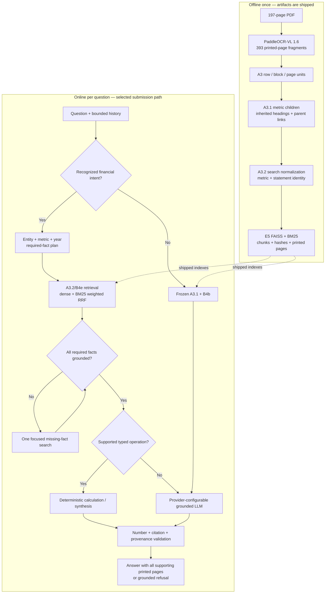

<!-- Filled from SUBMISSION_TEMPLATE.md. The required headings are unchanged. -->

# Submission

## How to run

Prerequisites: Python 3.11 or 3.12, `venv`, `make`, first-run network access for Python packages and the E5 query encoder, and an OpenAI-compatible, OpenAI, or Anthropic generation endpoint. OCR is **not** required: both production indexes are shipped in the repository.

From the repository root:

```bash
cp .env.example .env
# Set LLM_PROVIDER, LLM_MODEL, LLM_BASE_URL and LLM_API_KEY in .env.
make run-financial
```

The same configuration can be supplied without editing a file:

```bash
LLM_PROVIDER=openai_compatible \
LLM_BASE_URL=http://YOUR_HOST:PORT/v1 \
LLM_MODEL=YOUR_MODEL LLM_API_KEY=YOUR_KEY \
EMBEDDING_MODEL=intfloat/multilingual-e5-small \
make run-financial
```

`LLM_PROVIDER=openai` and `LLM_PROVIDER=anthropic` are also supported. `LLM_MODEL_FAST` and `LLM_MODEL_STRONG` are optional; both fall back to `LLM_MODEL`. No model, credential, server address, or `/home/ubuntu/...` path is hard-coded.

Run the 10 published questions non-interactively with:

```bash
make evaluate-financial QUESTIONS=techcombank_rag/data/evaluation/public.json
```

The evaluator writes per-question JSONL and an adjacent summary with retrieval, answer, citation, refusal, latency, token, cost, and failure metrics. Useful checks are:

```bash
make verify-financial-indexes   # hashes, dimensions, counts and BM25 alignment
make test                       # 160 unit/integration tests
```

The selected runtime reads the shipped `a32_metric_aware/all` index and uses the shipped `a31_semantic_multirepr/all` index as its conservative fallback. Each contains 3,658 aligned chunks, `index.faiss`, `chunks.jsonl`, `bm25.json.gz`, and checksummed metadata. Their repository sizes are approximately 22 MiB and 18 MiB respectively. The compact A0/B0 comparator is also shipped under `techcombank_rag/data/index/`. Graders never need to rerun PaddleOCR-VL or ingestion.

`.env.example` is the authoritative configuration reference. The normal grading path needs only the `LLM_*` values and the matching `EMBEDDING_MODEL`; `make run-financial` pins the shipped A3.2+B4e+B6 paths and disables experimental X-Router, B2, HyDE, cross-encoder, and B5-agent branches.

## Depth track(s) chosen

I chose two connected depth tracks.

1. **Document Intelligence:** convert a visually complex Vietnamese financial report into retrieval units that preserve headings, entities, table rows, years, units, and printed-page provenance. The progression was A0 PyMuPDF fixed chunks → A1 PaddleOCR-VL fixed chunks → A2 layout-aware blocks → A3 row/block/page representations → A3.1 metric children with inherited headings and parent expansion → A3.2 metric-identity normalization.
2. **Retrieval and controlled financial reasoning:** compare dense retrieval with routing, adaptive retrieval, HyDE, BM25 fusion, reranking, and bounded tools; then retain only components that improved the measured quality/latency frontier.

The central experiment was: **can a good index rescue a deliberately simple retriever, and can a stronger retriever rescue a poor index?** The evidence so far is asymmetric:

| Representation | Retrieval | Result | Interpretation |
|---|---|---|---|
| A0 fixed chunks | one-shot E5 dense | Public Hit@5 44.44% | The simple baseline often never exposed the answer. |
| A1 better OCR, same fixed chunking | one-shot E5 dense | A1a tied A0; A1b regressed to Hit@5 22.22% | Better transcription alone did not repair poor retrieval units. |
| A3.1 semantic multi-representation | the same one-shot E5 dense | Public Hit@5/10 reached 100% | A better index substantially improved a cheap, simple retriever. |
| A2 layout chunks | rule/LLM routing | limited dev gain; no public gain | More routing could not recreate table/heading relations absent from the selected representation. |
| A3.1/A3.2 | E5 + BM25 weighted RRF | best deployable balance | Strong representation and complementary lexical/semantic retrieval worked best together. |

This is not presented as a complete factorial causal study: B4 was not exhaustively rerun over every A0–A4 index. It is the empirical answer supported by the controlled runs available, and completing the full index × retriever matrix is the first proposed extension.

The frozen A0/B0 baseline scored 60% manual answer accuracy, Hit@5 44.44%, Hit@10 55.56%, and canonical citation recall 33.33%. Its three retrieval misses, one false refusal, and one citation error made evidence construction—not a larger answer model—the first priority.

The final selection is **A3.2 + B4e + selective B6**:

- **A3.2** distinguishes easily confused measures such as cash-flow service receipts, financial-note service income, and net fee income while retaining verbatim source text and page metadata.
- **B4e** uses dense E5 + BM25 weighted reciprocal-rank fusion, with metric-aware routing only where identity risk is detected; generic questions use the frozen A3.1+B4b path.
- **B6** recognizes a bounded set of financial intents, checks entity and required-fact coverage, permits at most one focused missing-fact retrieval, and uses typed arithmetic only when every operand is present in cited evidence.

## Architecture



| Block | Problem addressed | Contribution |
|---|---|---|
| PaddleOCR-VL checkpoint | The PDF contains dense layouts, tables, charts, and two printed pages on some PDF sheets. | Produces reusable printed-page fragments; it is offline and never required by graders. |
| Row/block/page representations | A fixed window can detach a value from its row, heading, year, or unit. | Offers precise child evidence and broader context without forcing every query to retrieve a full page. |
| Metric children + inherited headings | Important financial values can be buried inside large tables. | Lets the exact metric rank as a small child, then expands its parent for interpretation. |
| A3.2 identity fields | Similar labels can refer to different statements, scopes, or accounting meanings. | Preserves metric, statement, entity, year, and unit identity; OCR corrections are search-only, so citations remain verbatim. |
| E5 dense retrieval | Users paraphrase concepts and ask qualitative questions. | Finds semantic matches in Vietnamese at low CPU cost. |
| BM25 + weighted RRF | Dense retrieval can miss exact acronyms, years, numbers, and row labels; raw dense/BM25 scores are not calibrated. | Adds lexical recall and fuses ranks safely rather than mixing incomparable scores. |
| Selective B6 plan | Multi-entity, multi-page, and arithmetic questions need complete operands, not merely a high similarity score. | Checks explicit fact coverage and performs no more than one targeted second search. |
| Typed calculator/synthesis | Free-form generation can select the wrong operation or silently change units. | Executes only supported operations over literal retrieved operands and records operand pages. |
| Grounded LLM | Narrative answers still require concise natural-language synthesis. | The provider is replaceable; the model receives retrieved evidence rather than report-specific memorized answers. |
| Validators and refusal | A fluent answer may contain an unsupported number or incomplete citation set. | Allows citations only to retrieved printed pages, requires all supporting pages, repairs once when safe, otherwise refuses. |

History is used only to resolve follow-ups; it is never evidence. Hypothetical text and model memory can never become citations.

## What I tried that did not work

Each experiment had a plausible motivation, was isolated behind a configuration flag, and remains reproducible from its raw artifacts.

- **A1a/A1b — better OCR followed by fixed chunking.** PaddleOCR-VL is designed for complex multilingual document parsing, so I tested plain-text and Markdown serialization before changing retrieval. A1a tied A0 at 60% manual accuracy and 44.44%/55.56% Hit@5/10; A1b fell to 40% and 22.22%/33.33%. OCR fidelity and retrieval-unit quality were separate bottlenecks. Inspiration: Zhang et al., *PaddleOCR-VL-1.6* (2026) [technical report](https://arxiv.org/abs/2606.03264).
- **A2/A3/A4 as mutually exclusive winners.** Layout-aware A2 led early public accuracy, A3 multi-granularity led early dev coverage, and A4 selective parsing recovered some glossary/table pages, but no whole index dominated every split. The useful parts were generalized into A3.1 child/parent retrieval instead of choosing a page-heavy representation.
- **B1a/B1b — query routing.** The idea came from cost-aware conditional retrieval/reasoning. A deterministic router helped some A2 dev queries but did not improve A3.1 public retrieval. The Qwen LLM router achieved 72% route accuracy versus 100% for the reference rules on 25 routing cases, added 3.61 s p50 router latency, and reduced dev Hit@5 by 11.11 points versus the rules. This was an inspired ablation, not a reproduction of Wang et al., *X-Router* (Findings of ACL 2026) [paper](https://aclanthology.org/2026.findings-acl.994/).
- **B2 — AutoSearch-inspired adaptive retrieval, page deduplication, and MMR diversity.** Searching again only when evidence is incomplete should save work on easy questions. Deduplication reduced repeated page slots and evidence tokens, but the early sufficiency checker did not robustly bind entity, metric, year, unit, and value; diversity sometimes demoted the exact row, lowering Hit@5 without improving answer accuracy. B2 is a two-round lightweight controller, not the RL method in Sun et al., *AutoSearch* (Findings of ACL 2026) [paper](https://aclanthology.org/2026.findings-acl.1399/).
- **B3 — HyDE query expansion.** A hypothetical answer can bridge vocabulary mismatch, but its invented financial language can also move the query away from exact values. The best fusion improved dev Hit@5 from 55.56% to 61.11% and Hit@10 from 77.78% to 83.33%, while p50 latency rose from 4.77 s to 13.07 s and public manual accuracy fell from 10/10 to 9/10. Hypothetical text was never answer evidence. Inspiration: Gao et al., *Precise Zero-Shot Dense Retrieval without Relevance Labels* (ACL 2023) [paper](https://aclanthology.org/2023.acl-long.99/).
- **B4a — BM25 alone.** Exact matching was attractive for acronyms and numbers, but lexical retrieval lost paraphrased or explanatory evidence. The lesson was complementarity, which led to B4b dense+BM25 fusion using the rank-combination method of Cormack, Clarke, and Buettcher, *Reciprocal Rank Fusion Outperforms Condorcet and Individual Rank Learning Methods* (SIGIR 2009) [paper](https://doi.org/10.1145/1571941.1572114). The multilingual dense/sparse/multi-vector design space is discussed by Chen et al., *BGE M3-Embedding* (2024) [paper](https://arxiv.org/abs/2402.03216).
- **B4c/B4d — deterministic and cross-encoder reranking.** Finance rules did not improve public accuracy. `BAAI/bge-reranker-v2-m3` reached 80% manual dev accuracy, but CPU retrieval took approximately 9.8–11.6 s, internal-holdout manual accuracy remained 70% (equal to B4b), and public rank quality regressed. It was outside the observed deployment Pareto frontier.
- **B5 — always-on agent/tool orchestration.** A retrieval/calculator agent correctly derived `8.645 - 6.075 = 2.570` billion VND from page 257, but aggregate automatic accuracy did not change; internal-holdout retrieval mean rose from about 72 ms to 1.77 s and p95 reached 13.61 s. Tool availability alone did not guarantee correct planning. The typed-program direction was motivated by Chen et al., *FinQA* (EMNLP 2021) [paper](https://arxiv.org/abs/2109.00122), but the deployed lesson was to expose calculators only for recognized, fully grounded operations.
- **First B6 attempt — rerank every query.** This improved the targeted finance set but reduced internal-holdout Hit@5 to 66.67%. I rejected it and made B6 selective: unknown intents bypass it byte-for-byte.

The negative runs, configs, per-question rows, traces, and summaries are retained under `techcombank_rag/data/evaluation/experiments/`; they were not removed after the final method was selected.

## Evaluation

- **Splits and leakage policy:** `public.json` is the organizer's 10 published questions and was repeatedly inspected, so its final score is a post-calibration regression result—not a blind generalization estimate. `dev.json` contains 20 calibration diagnostics. `holdout.json` contains 10 internal diagnostics; per-question rules were not fitted to it, but aggregate scores were inspected during model selection, so it is also not claimed as an external blind test. The employer's hidden questions are the true generalization test. No public answer text or question ID is stored in either index.
- **Retrieval:** for the nine answerable public questions, Hit@1/5/10 and evidence recall use all supplied gold printed pages. Ranking is evaluated before generation. Multi-page questions receive credit only when the required gold evidence is covered.
- **Answer quality:** the automatic diagnostic requires complete numeric recall and token F1 ≥ 0.45; it is not exact string matching, but it still penalizes short correct glossary paraphrases. Therefore public answer accuracy is primarily a saved per-question manual semantic review, with automatic accuracy reported separately rather than silently substituted.
- **Citations:** precision and recall compare every cited printed page against all gold pages. Alternative pages are accepted only after direct source inspection and documented review. Citation format, page membership in retrieved evidence, and unsupported numeric claims are validated independently.
- **Safety:** refusal accuracy covers both false refusals and unsupported answers to unanswerable questions. Runtime errors and a failure taxonomy (`retrieval_miss`, `answer_error`, `citation_error`, `false_refusal`) are recorded.
- **Efficiency:** every model call logs provider/model, purpose, uncached/cached/output/reasoning tokens, latency, and measured or projected cost. Reports include end-to-end mean/p50/p95, retrieval time, call counts, and evidence tokens.

### Results on the 10 published questions

| Metric | Original A0/B0 | A3.1+B4b | Final A3.2+B4e+B6 |
|---|---:|---:|---:|
| Manual semantic answer accuracy | 60.0% | 90.0% | **100.0%** |
| Automatic diagnostic accuracy | — | 40.0% | **80.0%** |
| Retrieval Hit@1 | 11.11% | 66.67% | **66.67%** |
| Retrieval Hit@5 / Hit@10 | 44.44% / 55.56% | 100.0% / 100.0% | **100.0% / 100.0%** |
| Canonical citation precision / recall | 33.33% / 33.33% | 77.78% / 77.78% | **100.0% / 100.0%** |
| Refusal accuracy | 70.0% | 90.0% | **100.0%** |
| End-to-end p50 / p95 | 4.640 / 18.946 s | 5.197 / 9.603 s | **3.598 / 5.696 s** |

The final public run used only six LLM calls because safe deterministic synthesis handled supported cases. It scored 8/10 automatically but 10/10 on the saved semantic review: the remaining two automatic failures were concise, correct glossary answers penalized by token-F1. The final 20-question financial development diagnostic improved automatic/manual accuracy from 35%/55% to 75%/100%, Hit@5 from 65% to 90%, and tokens from 57,675 to 32,977. These are development results, not hidden-test claims. On the inspected internal holdout, final retrieval matched B4b and manual accuracy remained 70%.

The numbers changed the design in a traceable sequence: baseline misses moved work from prompting to representation; A1 moved it from OCR serialization to semantic chunks; A3/A3.1 justified child/parent evidence; B1–B3 prevented unconditional LLM control; B4 selected hybrid RRF over the slower cross-encoder; B5 rejected always-on tools; metric-confusion and multi-turn regressions produced A3.2/B4e; B6 was retained only after unknown intents were made a strict fallback.

Machine-readable evidence is under `techcombank_rag/data/evaluation/experiments/`; the corresponding interpretation and commands are under `techcombank_rag/docs/experiments/`.

## Cost and latency

### Measured environment

- Host: 2 × Intel Xeon Gold 6242 sockets, 16 cores/socket, 2 threads/core (64 logical CPUs), 251 GiB RAM, six NVIDIA RTX A5000 GPUs installed.
- Measured answer server: Qwen/Qwen3.5-9B on two RTX A5000 GPUs (`CUDA_VISIBLE_DEVICES=2,3`, 22 GiB memory cap per device), temperature 0, maximum 512 new tokens.
- Query embeddings: `intfloat/multilingual-e5-small`, 384 dimensions, normalized, on CPU. The optional cross-encoder ablation also ran on CPU.

### One-time ingestion

The source has 197 PDF pages/sheets and produced 393 printed-page fragments because many sheets contain two report pages. The PaddleOCR-VL 1.6 checkpoint completed in **35,573.843 s (9 h 52 m 53.843 s) wall time** on the recorded local/contention run. Individual fragment durations averaged 302.938 s (median 216.966 s, p95 797.408 s); these overlap under concurrency and must not be summed as wall time. A3.1 construction reused the checkpoint and took **483.753 s (8 m 3.753 s)**. A3.2 derivation reused A3.1—no OCR—and took **561.280 s (9 m 21.280 s)**.

The offline pipeline used self-hosted OCR/embedding and incurred **USD 0 API charges**; electricity, hardware depreciation, and engineering time are not priced. Graders use the shipped indexes, so their ingestion time and OCR API cost are zero.

### Per-query generation

For the selected 10-question public run:

- mean / p50 / p95 end-to-end latency: **2.821 / 3.598 / 5.696 s**;
- tokens: **22,578 input + 246 output = 22,824 total**, or **2,282 tokens/question** on average;
- calls: **6 total** across 10 questions;
- measured self-hosted API charge: **USD 0** (hardware cost excluded).

Using the repository's dated price snapshot and exactly the same token exposure—not assuming equal quality—the projected total/per-question API costs are:

| Provider model | 10 questions | Per question |
|---|---:|---:|
| GPT-5.6 | $0.095232 | $0.009523 |
| GPT-5.6 Terra | $0.048108 | $0.004811 |
| GPT-5.6 Luna | $0.004811 | $0.000481 |
| Claude Sonnet 5 | $0.071424 | $0.007142 |
| Claude Opus 5 | $0.119040 | $0.011904 |

These figures are estimates, not invoices; provider prompt caching, tokenizer differences, reasoning-token accounting, and different answer lengths may change real cost.

## What I deliberately did not build

- **No mandatory cloud deployment:** the requirement is clean-machine reproducibility and provider portability. A local or remote OpenAI-compatible endpoint is sufficient.
- **No ingestion during grading:** OCR is expensive and unnecessary. Both selected indexes, their chunks, BM25 artifacts, model metadata, and checksums are committed.
- **No claim of blind 100% generalization:** the 10 published questions were calibration-visible. The document contains the evidence, but the indexes contain no stored answers or question-specific IDs.
- **No full AutoSearch reproduction:** the paper trains an RL policy; B2 was intentionally a maximum-two-round inspired ablation, and it did not earn a place in the final path.
- **No RAG-on-a-Diet claim:** Ding and Zhao's *RAG-on-a-Diet* (ACL 2026) [paper](https://aclanthology.org/2026.acl-long.1562/) learns hop-wise model selection and stopping with behavior cloning/PPO. This submission has deterministic bounded control, not that trained policy.
- **No always-on router, HyDE, cross-encoder, or agent:** each increased latency or introduced regressions in the measured setting. Their modules remain independently switchable for ablation.
- **No answer arithmetic by hope:** unsupported operations refuse. The calculator accepts only retrieved literal operands with compatible units and source pages.
- **No generated evidence:** conversation history, hypothetical documents, model memory, and calculator output cannot be cited as report sources.
- **No heavy framework dependency:** the control flow is small, inspectable Python rather than a LangChain graph. This reduces hidden retries/state and makes a 45-minute walkthrough possible.
- **No embedding fine-tuning or learned sparse retrieval:** there was insufficient independent Vietnamese financial relevance data to justify training without overfitting; BM25 supplies the auditable lexical complement.

## With 10x time and budget

1. **Complete the causal matrix.** Rebuild every A0–A4/A3.2 representation with identical document coverage and run each with dense-only, BM25-only, hybrid RRF, learned sparse, and reranked retrieval. This directly tests whether good indexing rescues simple retrieval and whether strong retrieval rescues weak indexing.
2. **Create a real blind benchmark.** Add multiple Vietnamese annual reports, complete multi-page evidence sets, adversarial entity/statement confusions, two independent reviewers, and a never-inspected test split. Report confidence intervals and paired significance tests.
3. **Benchmark encoders before choosing one.** Compare E5 with Vietnamese and multilingual candidates on the frozen chunks, including BGE-M3's dense/sparse/multi-vector modes (Chen et al., 2024 [paper](https://arxiv.org/abs/2402.03216)) and a SPLADE-style learned sparse arm (Formal et al., 2021 [paper](https://arxiv.org/abs/2107.05720)). Measure quality, memory, build time, and CPU/GPU latency.
4. **Train rather than imitate adaptive policies.** With enough trajectories, reproduce AutoSearch for search-depth control and RAG-on-a-Diet for hop-wise fast/medium/strong model selection. Compare them with the deterministic B6 controller on answer quality per dollar and per second.
5. **Run a controlled generator scale study.** On identical retrieved evidence and identical GPUs, compare Qwen 9B with larger Qwen and Llama Instruct models plus strong hosted models. Record reasoning/output tokens separately, citation completeness, arithmetic program accuracy, refusal calibration, and cold/warm p50/p95. A preliminary Llama-3-8B CPU run preserved retrieval but was too hardware-confounded for a fair latency conclusion; the expanded study would remove that confound.
6. **Add program-supervised financial reasoning.** Extend B6 from hand-audited operations to FinQA-style executable programs with unit/type checking and claim-level provenance; score both final answers and intermediate programs.
7. **Add visual retrieval for charts and difficult tables.** Compare OCR text retrieval with the late-interaction page-image approach of Faysse et al., *ColPali: Efficient Document Retrieval with Vision Language Models* (ICLR 2025) [paper](https://arxiv.org/abs/2407.01449), while preserving printed-page provenance and measuring GPU/storage cost before deployment.
8. **Calibrate a generation-aware retriever router.** Rerun routing only after sufficient labels exist, using both retrieval relevance and downstream answer utility rather than query keywords alone, following the motivation of Zhao et al., *R³AG* (ACL 2026) [paper](https://aclanthology.org/2026.acl-long.939/).

## Demo video
